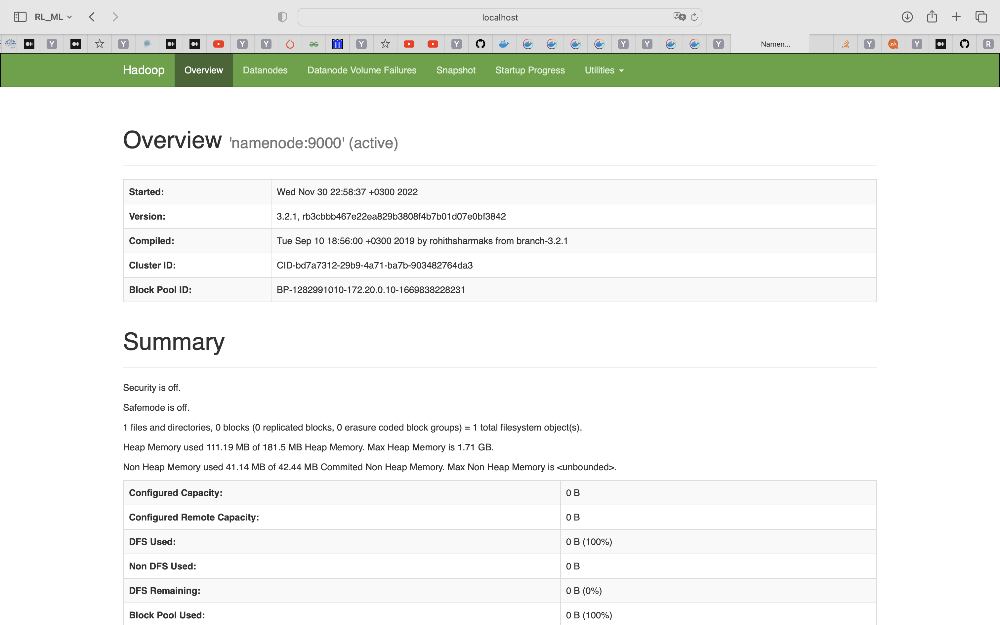
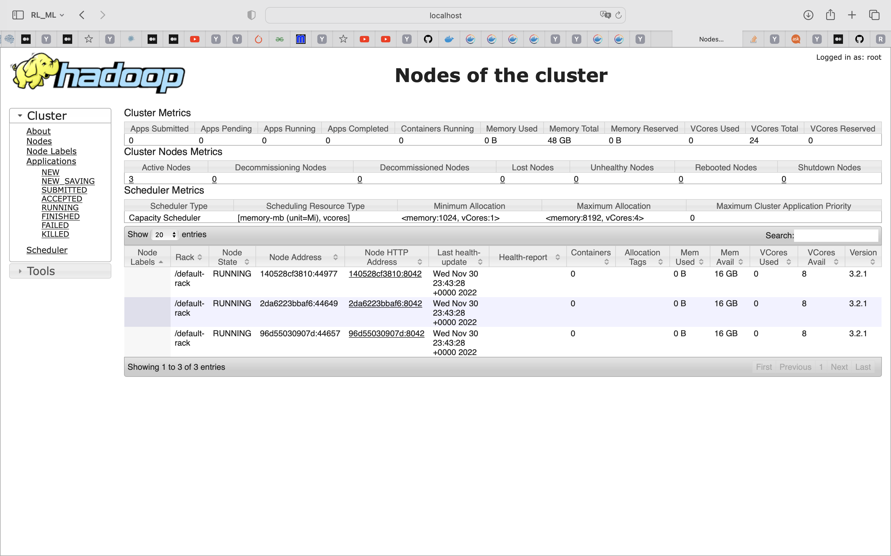
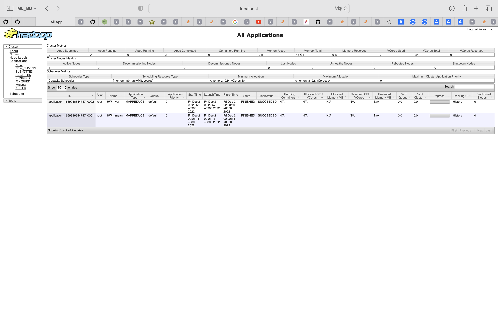

# HW1

## Part 1

Для разворачивания распределенной файловой системы будем использовать docker. Для этого необходимо установить docker и docker-compose. Для установки docker-compose можно воспользоваться инструкцией из [официальной документации](https://docs.docker.com/compose/install/).

```bash
cd docker_repo
git clone https://github.com/big-data-europe/docker-hadoop.git
cd ..
cp -fR part1/docker_changes/* docker_repo/docker-hadoop
cd docker_repo/docker-hadoop
docker compose up --force-recreate
```

Можно открыть в браузере [http://localhost:9870](http://localhost:9870) и убедиться, что файловая система работает.
Менеджер ресурсов Hadoop доступен по адресу [http://localhost:8088](http://localhost:8088).

Скриншоты:





## Part 2

Предварительно загрузим данные с [kaggle](https://www.kaggle.com/datasets/dgomonov/new-york-city-airbnb-open-data) в папку `part2/data`.

Скопируем данные на docker-контейнер а затем в HDFS:

```bash
docker cp part2/data/AB_NYC_2019.csv namenode:/
docker exec -it namenode bash
hdfs dfs -put AB_NYC_2019.csv /
```

Получим локальные результаты:

```bash
    cd part2/src
    cat ../data/AB_NYC_2019.csv | python3 mapper_mean.py | sort | python3 reducer_mean.py > ../results/local_result_mean.txt
    cat ../data/AB_NYC_2019.csv | python3 mapper_var.py | sort | python3 reducer_var.py > ../results/local_result_var.txt
```

Получим результаты на hadoop:

```bash
    docker cp part2/src/. namenode:/HW1/
    docker exec -it namenode bash
    cd HW1/ 
    bash run.sh
    exit
    docker cp namenode:/HW1/hadoop_result_mean.txt part2/results/
    docker cp namenode:/HW1/hadoop_result_var.txt part2/results/
```

### Results

|             | Count | Mean               | Variance          |
| ----------- | ----- | ------------------ | ----------------- |
| Local var   | 48895 | 152.72068718682831 | 57672.84569843323 |
| Local mean  | 48895 | 152.7206871868289  |                   |
| Hadoop var  | 48895 | 152.7206871868291  | 57672.84569843324 |
| Hadoop mean | 48895 | 152.72068718682894 |                   |
