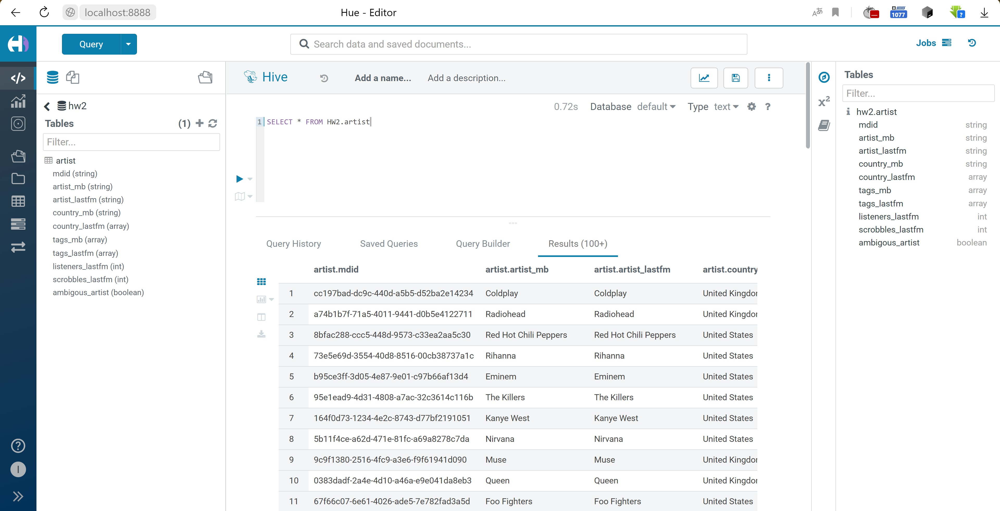
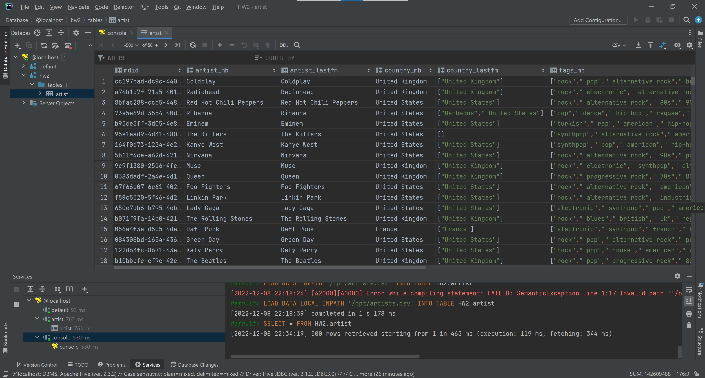
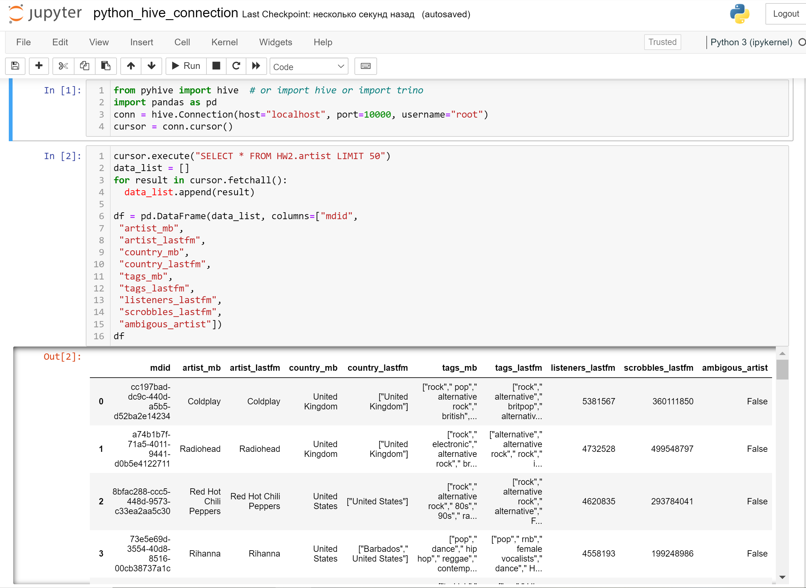

# HW2

## Part 1

Задание выполнененно в ос Windows с помощью wsl2 и docker

Скачиваем и запускаем docker

```bash
git clone https://github.com/tech4242/docker-hadoop-hive-parquet.git
docker compose up --force-recreate
```

### Hue

Уже настроен остается только перейти по ссылке http://localhost:8888



### DataGrip



### Python



## Part 2

Скачаем [данные](https://www.kaggle.com/datasets/pieca111/music-artists-popularity) в папку data/

Положим данные в hive. Для этого сначала скопируем данные в контейнер, а затем запустим hive и выполним ddl запрос для создания таблицы.

local -> docker (hive-server) -> hive

```bash
docker cp part2/create_table.hql docker-hadoop-hive-parquet-hive-server-1:/opt/
docker cp data/artists.csv docker-hadoop-hive-parquet-hive-server-1:/opt/
docker exec -it docker-hadoop-hive-parquet-namenode-1 bash
hive -f create_table.hql
```

**Запрос №4
Вывести топ стран по количеству композиторов классической музыки.**

Выполним запросы

```bash
docker cp part2/query1.hql docker-hadoop-hive-parquet-hive-server-1:/opt/
docker cp part2/query2.hql docker-hadoop-hive-parquet-hive-server-1:/opt/
docker cp part2/query3.hql docker-hadoop-hive-parquet-hive-server-1:/opt/
docker cp part2/query4.hql docker-hadoop-hive-parquet-hive-server-1:/opt/
docker exec -it docker-hadoop-hive-parquet-hive-server-1 bash
hive -f query1.hql > result1.txt
hive -f query2.hql > result2.txt
hive -f query3.hql > result3.txt
hive -f query4.hql > result4.txt
docker cp docker-hadoop-hive-parquet-hive-server-1:/opt/result1.txt part2/
docker cp docker-hadoop-hive-parquet-hive-server-1:/opt/result2.txt part2/
docker cp docker-hadoop-hive-parquet-hive-server-1:/opt/result3.txt part2/
docker cp docker-hadoop-hive-parquet-hive-server-1:/opt/result4.txt part2/
```

Результаты запросов

Query 1

| mdid | artist\_mb | artist\_lastfm | country\_mb | country\_lastfm | tags\_mb | tags\_lastfm | listeners\_lastfm | scrobbles\_lastfm | ambigous\_artist |
| :--- | :--- | :--- | :--- | :--- | :--- | :--- | :--- | :--- | :--- |
| b10bbbfc-cf9e-42e0-be17-e2c3e1d2600d | The Beatles | The Beatles | United Kingdom | \["United Kingdom"\] | \["rock"," pop"," progressive rock"," 80s"," heavy metal"," pop-rock"," orchestral"," experimental"," british"," uk"," 60s"," hard rock"," indie rock"," folk rock"," psychedelic rock"," psychedelic"," blues rock"," britpop"," art rock"," folk-rock"," psychedelic pop"," pop rock"," british invasion"," rock and roll"," rock roll"," english"," sunshine pop"," folk pop"," liverpool"," parlophone"," united kingdom"," hair metal"," 1"," bbc"," classic pop and rock"," singer songwriter"," classical pop"," instrumental pop"," merseybeat"," adult alternative pop rock"," tribute albums"," british psychedelia"," orchestral pop"," pop-metal"," male vocalists"," the-beatles"," boys band"," rock & roll"," pop/rock"," rhythm & blues"," overrated"," art pop"," one beatles"," a filk artist"," british rhythm & blues"," beat music"\] | \["classic rock"," rock"," british"," 60s"," pop"\] | 3674017 | 517126254 | false |


Query 2

| tag | tag\_count |
| :--- | :--- |
| seen live | 99540 |

Query 3

| tag | artist\_lastfm | listeners\_lastfm | rank |
| :--- | :--- | :--- | :--- |
| seen live | Coldplay | 5381567 | 1 |
| rock | Coldplay | 5381567 | 1 |
| pop | Coldplay | 5381567 | 1 |
| electronic | Coldplay | 5381567 | 1 |
| indie | Coldplay | 5381567 | 1 |
| alternative | Coldplay | 5381567 | 1 |
| experimental | Radiohead | 4732528 | 1 |
| female vocalists | Rihanna | 4558193 | 1 |
| All | Jason Derülo | 1872933 | 1 |
| under 2000 listeners | Diddy - Dirty Money | 503188 | 1 |


Query 4

| country\_mb | country\_count |
| :--- | :--- |
| United States | 450 |
| United Kingdom | 280 |
| France | 263 |
| Italy | 238 |
|  | 237 |
| Germany | 224 |
| Japan | 177 |
| Austria | 74 |
| Russia | 65 |
| Spain | 63 |
| Netherlands | 55 |
| Poland | 48 |
| Czech Republic | 46 |
| Finland | 38 |
| Belgium | 36 |
| Australia | 36 |
| Sweden | 35 |
| Canada | 32 |
| Norway | 30 |
| Brazil | 25 |
| Switzerland | 22 |
| Denmark | 22 |
| Hungary | 18 |
| Argentina | 16 |
| Estonia | 14 |
| Ukraine | 13 |
| Turkey | 12 |
| Romania | 12 |
| Iceland | 12 |
| China | 12 |
| Portugal | 11 |
| Ireland | 11 |
| Mexico | 11 |
| Greece | 9 |
| Soviet Union | 9 |
| Iran | 8 |
| Latvia | 8 |
| Lithuania | 7 |
| India | 6 |
| New Zealand | 6 |
| Armenia | 6 |
| Slovakia | 4 |
| Serbia | 3 |
| Bulgaria | 3 |
| Israel | 3 |
| South Africa | 3 |
| Georgia | 3 |
| Azerbaijan | 3 |
| Lebanon | 2 |
| Venezuela | 2 |
| South Korea | 2 |
| Philippines | 2 |
| Peru | 2 |
| Jamaica | 2 |
| Cuba | 2 |
| Croatia | 2 |
| Uzbekistan | 1 |
| Vietnam | 1 |
| Liechtenstein | 1 |
| Chile | 1 |
| Macedonia | 1 |
| Mongolia | 1 |
| Morocco | 1 |
| Pakistan | 1 |
| Belarus | 1 |
| Palestine | 1 |
| Slovenia | 1 |
| Tunisia | 1 |
| Uruguay | 1 |
| Czechoslovakia | 1 |
| Indonesia | 1 |

